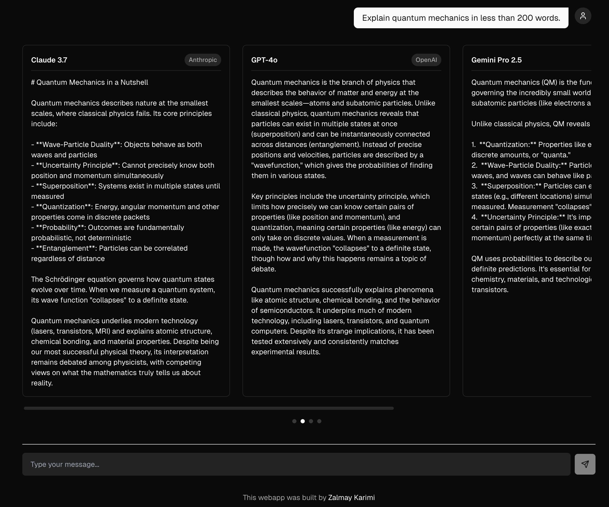

# GroupThink

A streaming AI chat application that allows users to compare responses from multiple language models side-by-side in real-time.

**[DEMO](https://multimodel.zkarimi.com)**

## Features

- **Multi-Model Comparison**: See how different language models respond to the same prompt simultaneously 
- **Open Mode**: Use your own OpenRouter API key to access various AI models without requiring a subscription 
## Tech Stack

- **Framework**: Next.js 15 with App Router
- **Language**: TypeScript
- **Styling**: Tailwind CSS 
- **UI Components**: Radix UI primitives with custom components
- **AI Integration**: OpenAI SDK, OpenRouter API

## Open Source

This project is open source and welcomes contributions. The "Open Mode" feature allows anyone to use the application with their own OpenRouter API key, providing access to a wide range of AI models without requiring a subscription.

## Getting Started

1. Clone the repository
2. Install dependencies with `npm install`
3. Configure environment variables (see `.env.local.example`)
4. Run the development server with `npm run dev`

## License

[MIT](LICENSE)
 